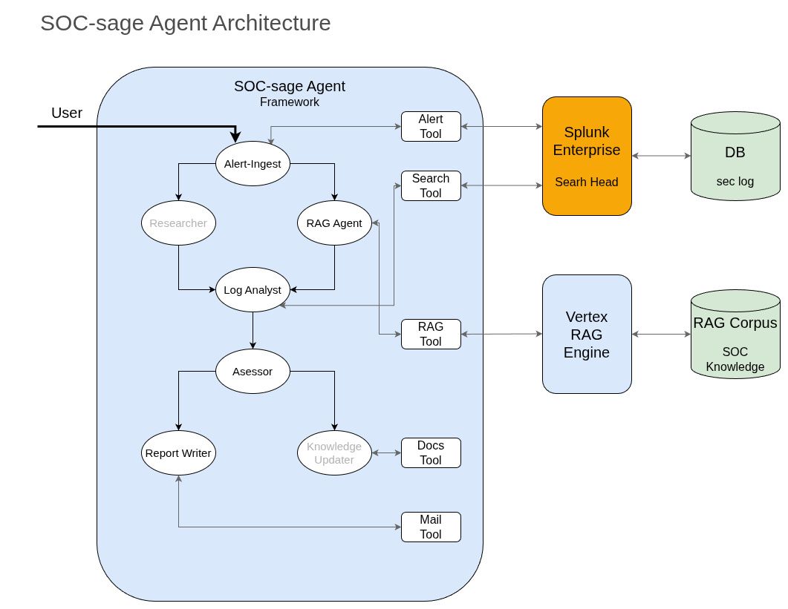

# soc-sage
Sage Agent for Security Operation Center (soc-sage) is a multi-agent security operation system that automatically analyze raw Splunk alerts based on user-defined manuals.

## Key features
- **RAG-based analysis** - retrieves the existing manuals for security alerts and past incidents
- **LLM assessment** - Evaluate risk of the alerts and report

## Architecture


## Setup and Instllation

### Prerequisites
- Python 3.9+: Ensure you have Python 3.9 or a later version installed.
- Poetry: Install Poetry by the instructions on the offcial website: https://python-poetry.org/docs/
- Git: Eusure you have git installed.

### Setup
1. Install Dependencies with Poetry:
```bash
poetry install
```
For developers: install dev dependencies too.
```bash
poetry install --with dev
```

2. Activate the Poetry Shell
```bash
eval $(poetry env activate)
```
3. Set up Environment Variables: Create a file ".env" and set up the environment variables. See the ".env.example" to check the lists of the variables.

## Format and Lint

### Format
Use Pyinc to format your codes.
```bash
pyinc {souce_file}
```

### Lint
Use Plylint to lint your codes.
```bash
pylint {source_file}
```